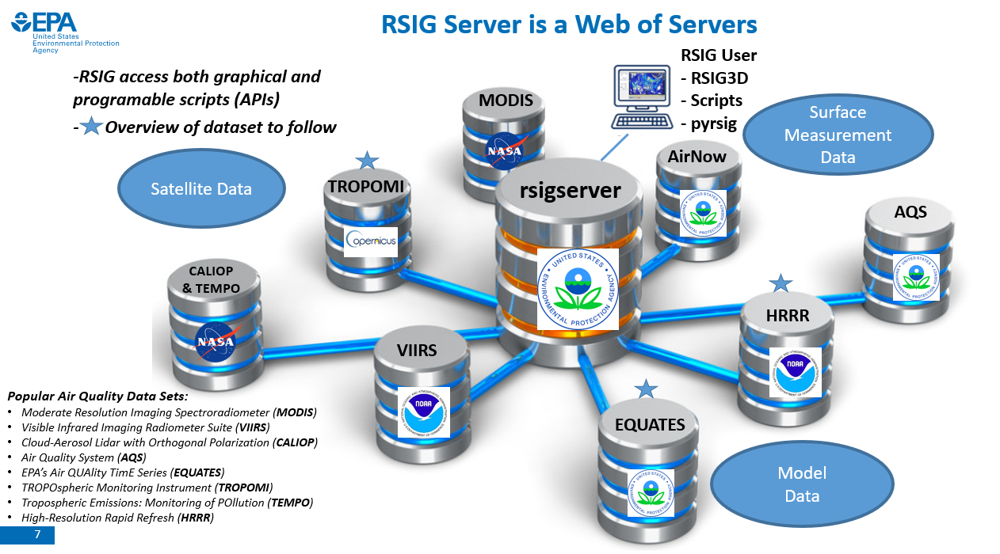
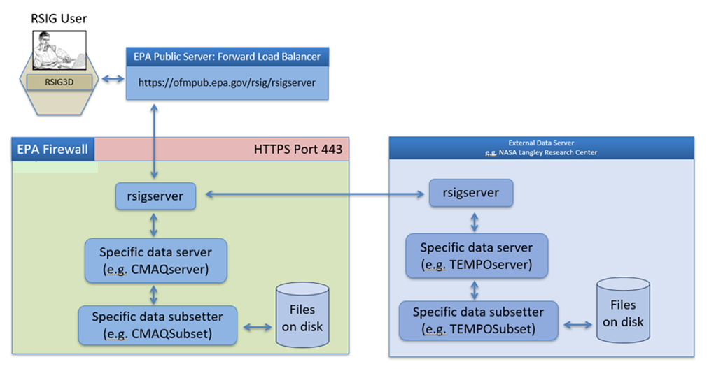
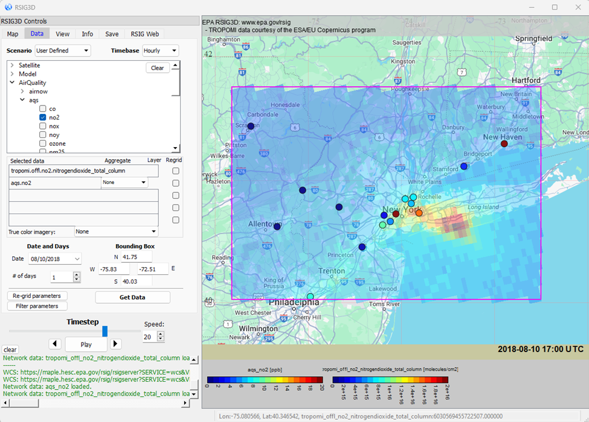

# Notes on RSIG3D.

The EPA Remote Sensing Information Gateway (RSIG) is a free multi-platform, scriptable software system that creates a consolidated access point to 100’s of terabytes (TB) of air quality relevant model, measurement and satellite data sets. It provides quick and easy ways of retrieving, visualizing and saving subsets geospatial atmospheric data. Broadly speaking, the RSIG system consists of two main parts: RSIG3D and rsigserver.

### RSIG3D
RSIG3D is a standalone application for Windows, Mac OS X, and Linux systems with a richly immersive and interactive visualization capability. It offers 2D and 3D visualization and saving of data for later analysis. RSIG3D receives raw data from a backend web service called rsigserver that streams subsets of atmospheric data. Since RSIG3D operates on raw data (often 3D, up to one week) rather than images of the data, the user's computer requires about 8GB or more of memory (enough for up to 5 global datasets).

### rsigserver
rsigserver is a web service that conforms to the Open Geospatial Consortium (OGC)-Web Coverage Services (WCS)/Web Mapping Services (WMS) standards. It acts as the central node in a distributed data system, fanning out to specific other data servers (e.g. airnowserver, temposerver, etc.), and can be used independently of RSIG3D.

---
  
 *Figure 1: RSIG overview*

---

*Figure 2: Simplified RSIG data flow*

---

*Figure 3: A screenshot of the RSIG3D application. Ground sensors for the AirNow/AQS system show NO2 data (circles), along with vertical column measurements of NO2 from the TROPOMI satellite showing a well-defined plume.*

---

### RSIG system
The RSIG system (RSIG3D + rsigserver) uses the following computers / webservices:
  1. User computer - Mac, Windows or Linux.
  2. ofmpub.epa.gov/rsig/rsigserver - public host for forwarding access to EPA internal server.
  3. EPA internal computer hosting CMAQ, VIIRS, TROPOMI data archives, subset programs, etc.
  4. cain.larc.nasa.gov - NASA Langley computer hosting TEMPO and CALIPSO satellite data.
  5. modwebsrv.modaps.eosdis.nasa.gov/cgi-bin/RSIGservice - NASA computer hosting MODIS satellite data.
  6. gibs.earthdata.nasa.gov/wms/epsg4326/best/wms.cgi for true color satellite images.
  7. aqcsv.airnowgateway.org for Airnow data.
  8. EPA internal database for AQS data.
  
The EPA Environmental Modeling and Visualization Laboratory (EMVL) created OGC-WCS webservices that invoke EMVL-developed subset programs for extracting subsets (by time, lon-lat box and variable) of data from sets of data files. These include rsigserver and other data specific servers, e.g. temposerver).

### RSIG3D Depends on the following programs at runtime:  

External Open Source:
  1. curl - for invoking webservices to get data.
  2. gzip - for compressing/decompressing data streams.
  3. ffmpeg - for creating video files
  4. ssh, scp - for accessing other client computers for CMAQ file read/load.  
  
Internal EMVL-developed:
  1. CMAQSubset - For reading subsets of CMAQ data files.

### Compiling utilities:  
  1. g++
  2. On Windows: both MinGW (for UNIX command-line utilities such as /bin/sh) and mingw-w64 (for g++ -m64).
  
### System libraries:
  1. OpenGL for graphics.  
  
### External Open Source Libraries (C and C++):  

  2. Qt (GUI) ../../../../package/QT
  All other source code is at ../../libs/ 
  3. QMapControl
  4. PropertyEditor
  5. Marble (projected maps).
  6. glew
  7. netcdf
  8. shapelib
  9. GPC (polygon clipping)
  10. png
  11. zlib
  
### Internal EMVL-developed Libraries (C and C++):  
  1. vector*.h - templates for vectors.
  2. Utilities - emvl utility macros and routines.
  3. Dataset - emvl::Dataset and emvl::DatasetManager which retrieves data from rsigserver public webservice.

### Key Runtime Object Structure:  

  1. emvl::DatasetManager - Singleton that manages (creates, owns, deletes) emvl::Datasets.
  2. emvl::Dataset - Holds data retrieved. May page large (CMAQ, Grid, Swath) datasets to/from disk. All subset data files are written to and read from $HOME/.rsig/\*.xdr
  3. RSIGScene - Singleton Model (see also RSIGState).
  4. MainWin - Singleton View/Controller (see also ControlDockWidget).
  5. GeoDataList - Singleton list of GeoDataObjects.
  6. VisDataList - Singleton list of VisDataObjects.
  7. GeoDataObject - ->mObject points to a emvl::Dataset and adds objects for rendering.
  8. LookupTable - a colormap "lut".
  9. VisDataObject - Defines user-editable rendering properties, opacity, etc.
  10. emvl::DatasetManager\[ index of emvl::Dataset \]
  11. GeoDataList\[ index of GeoDataObjects \]
  12. GeoDataObject->mModel = pointer to emvl::Dataset owned by emvl::DatasetManager.
  13. VisDataObject.point/vector/polygon = Rendering options associated with a parent GeoDataObject.
  14. VisDataObject.lut = Colormap for parent GeoDataObject.
 
 ### Misc notes:  
  - Data streams are saved to disk in the $HOME/.rsig directory.
  - GUI event functions are defined in ControlDockWidgets_slots.cpp
  - Qt based GUI widgets are defined by \*.ui files. Edit manually or use Qdesigner.
  - Up to 5 datasets can be selected and retrieved concurrently via threads.
  - CMAQFileReaderDialog (sub-Controller) uses CMAQFileReaderModel (sub-Model of RSIGScene) synchronously/blocking. 
  - List of available data sources/variables is found in the set of file rsig_variables\*.txt which are read at compile time to generate a GUI menu.
  - Application state is saved to $HOME/.rsig3d.xml each time the user quits the program (other than via control-c / kill -9).

  - To install the application on a client computer:
    1. https://www.epa.gov/rsig
    2. Click link for platform-specific zip file on "Downloading RSIG" sidebar.

  - To remove the application from a client computer:
    1. Delete $HOME/.rsig
    2. Delete $HOME/.rsig3d.xml
    3. Delete $HOME/RSIG3D

